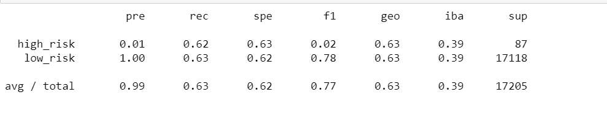

# Credit_Risk_Analysis
Machine Learning

## Analysis and Purpose
This project has been undertaken on behalf of "Fast Lending", a fictitious peer to peer lending services company that uses machine learning to predict credit risk. Credit Risk is an inherently unbalanced classification problem, as good loans easily outnumber risky loans. Therefore, different techniques have been employed to train and evaluate models with unbalanced classes. This analysis includes evaluating several models to understand their efficiency to predict credit risk. The models used for this analysis include - 

- Sampling models to predict credit risk - **RandomOverSampler , Synthetic Minority Oversampling Technique (SMOTE) Oversampling, Cluster Centroid Undersampling**
- **SMOTEENN** algorithm to predict credit risk
- Ensemble Classifiers to predict credit risk - **BalancedRandomForestClassifier, EasyEnsembleClassifier**

## Resources
- Data : LoanStats_2019Q1.csv
- Software : Python, Jupyter Notebook

## Results

### 1.Random Oversampling Model

#### Observations

1. The balanced accuracy score of the Random Oversampling Model is approximately 63%
2. The precision for high-risk loans is very low at 1% and very high for low-risk loans at 100%
3. The recall for high-risk loans is around 57% and it is  68% for low-risk loans

 ### 2.SMOTE Oversampling Model
 
 
 
 
 
 
 
 #### Observations
 
 1. The balanced accuracy score for the SMOTE model is approximately 63%.
 2. The precision is low for high-risk loans at 1% and high for low risk loans at 100%
 3. The recall is similar for both high-risk and low-risk loans at approximately 63% 

### 3.Cluster Centroids Undersampling Model

#### Observations

1. The balanced accuracy score for the Cluster Centroids Undersampling model is approximately 52%
2. The precision is very low for high-risk loans and very high for low-risk loans at 1% and 100% respectively
3. The recall for high-risk loans is around 57% and for low-risk loans is around 46%

### 4.SMOTEENN Model

#### Observations

1. The balanced accuracy score of this model is approximately 62%
2. The precision is very low for high-risk loans and very high for low-risk loans at 1% and 100% respectively
3. The recall for high-risk loans is around 70% and for low-risk loans is around 54%

### 5.BalancedRandomForestClassifier Model

#### Observations

1. The balanced accuracy score for this model is approximately 79%
2. The precision for high-risk loans is approximately 40% and for low-risk loans is 100%
3. The recall for high-risk loans is approximately 67% and for low-risk loans is approximately 91%

### 6.EasyEnsembleClassifier Model

#### Observations

1. The balanced accuracy score for this model is approximately 93%
2. The precision for high-risk loans is approximately 70% and 100% for low-risk loans
3. The recall for high-risk loans is approximately 91% and 94% for low-risk loans

**Note**

*Precision is the measure of how reliable a positive classification is. A low precision is indicative of a large number of false positives.*

*Recall is the ability of the classifier to find all the positive samples. A low recall is indicative of a large number of false negatives.*

 
